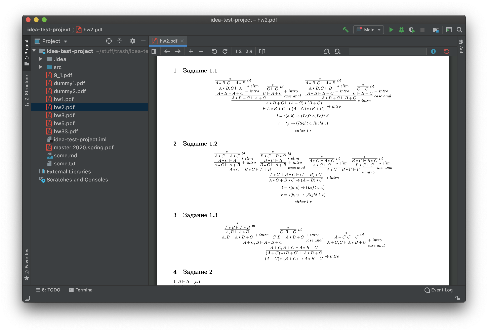
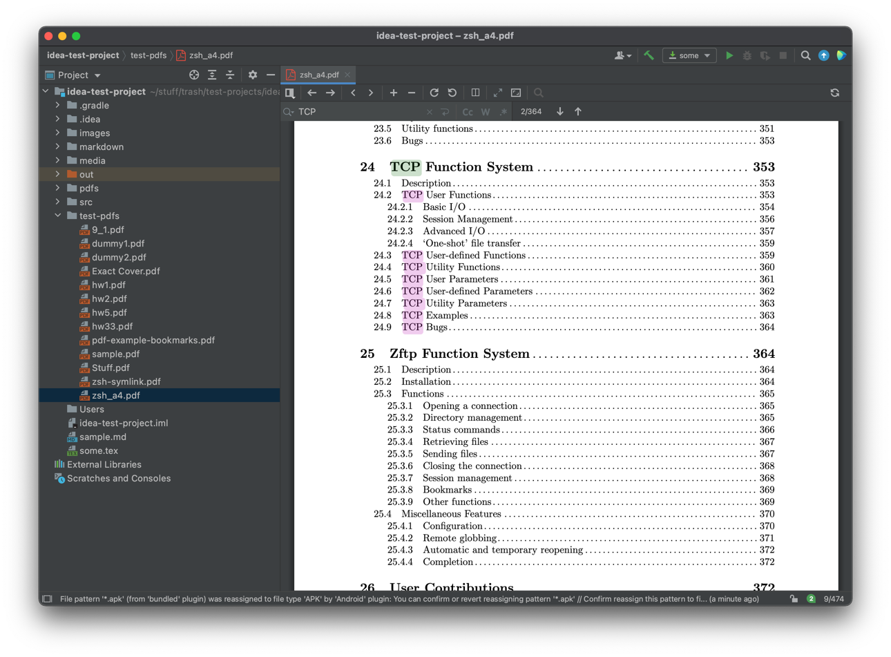

# IntelliJ PDF Viewer

<!-- Plugin description -->

[IntelliJ PDF Viewer](https://plugins.jetbrains.com/plugin/14494-pdf-viewer) plugin adds support for viewing PDF files in IntelliJ-based IDEs. This plugin uses recently integrated (`2020.2`) CEF (Chromium Embedded Framework) browser to render PDF documents with [PDF.js](https://mozilla.github.io/pdf.js/) library.

## Features

- Document navigation
- Integration with [TeXiFy IDEA](https://plugins.jetbrains.com/plugin/9473-texify-idea)
- Auto-refresh on document change
- Text search
- Document scaling
- Thumbnail view
- Sections list
- Structure view
- Presentation mode
- Document information
- Pages spread (even/odd)
- Horizontal/vertical pages scroll directions
- Customizable toolbar

## Shortcuts
- **Move editor up or down:** up and down arrow keys.
- **Move editor right or left:** right and left arrow keys.
- **Move to the next page:** when the whole width of the page is in view, the right and left arrow keys will navigate to the next and previous page.
- **Zoom in:** <kbd>Ctrl</kbd> + <kbd>+</kbd>, <kbd>Ctrl</kbd> + <kbd>=</kbd>.
- **Zoom out:** <kbd>Ctrl</kbd> + <kbd>-</kbd>
- **Reset zoom:** <kbd>Ctrl</kbd> + <kbd>0</kbd>
- **Enter presentation mode:** <kbd>Ctrl</kbd> + <kbd>Alt</kbd> + <kbd>p</kbd>
- **Inverse search (LaTeX):** <kbd>Ctrl</kbd> + <kbd>Left click</kbd> (can be customized in Settings | Keymap to other mouse shortcuts)

### Feature Notes

* Text search will work only in text-based documents. For example, it won't work in all-images documents (books scans).
* For the sections list or structure view to work documents should define sections list. Otherwise, sections view won't be active, and the structure view will be empty.
* Right-click on a pdf to open it in PDFium, the default Chrome PDF viewer. If you do not see a context menu, it may help to go to Help > Find Action, search for Registry, set `pdf.viewer.use.jcef.osr.view` to false, and restart. See [IJPL-59459](https://youtrack.jetbrains.com/issue/IJPL-59459/Context-menu-does-not-work-for-OSR-Cef-browser) for more details.
* To view pdfs in a Code With Me session, you may need to install the PDF viewer plugin (0.17.0 or later) in the client as well. This feature is still expirimental, for more info see [CWM-1199](https://youtrack.jetbrains.com/issue/CWM-1199).

## Use cases

- Writing latex documents
- Split-view code and documentation
- Presentations with live-coding
- ...

## Providing Feedback

If you want to support PDF Viewer development, just [give a star on GitHub](https://github.com/FirstTimeInForever/intellij-pdf-viewer) or write a review on the [marketplace page](https://plugins.jetbrains.com/plugin/14494-pdf-viewer).

In case you encountered any bugs, feel free to create an [issue](https://github.com/FirstTimeInForever/intellij-pdf-viewer/issues).

<!-- Plugin description end -->

## Installation

### Stable Versions

* Using IDE built-in plugin system: `Preferences` > `Plugins` > `Marketplace` > `Search for "PDF Viewer"` > `Install Plugin`. (See [Install plugin from repository](https://www.jetbrains.com/help/idea/managing-plugins.html#install_plugin_from_repo))

* Manually: download the [latest release](https://github.com/FirstTimeInForever/intellij-pdf-viewer/releases/latest) and install it manually using
  `Preferences` > `Plugins` > `⚙️` > `Install plugin from disk...`. (See [Install plugin from disk](https://www.jetbrains.com/help/idea/managing-plugins.html#install_plugin_from_disk))

### Alpha Versions

* Add `https://plugins.jetbrains.com/plugins/alpha/14494` to the list of plugin repositories in  `Settings` > `Plugins` > `⚙️` > `Manage Plugin Repositories` > `➕`. (See [Custom plugin repositories](https://www.jetbrains.com/help/idea/managing-plugins.html#repos))

* Or manually download latest alpha release from [here](https://plugins.jetbrains.com/plugin/14494-pdf-viewer/versions/alpha) and install it in the same way as stable version.

## Screenshots

## Development

To build plugin use `buildPlugin` gradle task. This will produce ready to use `zip` archive with plugin contents.

To run/debug IDE with this plugin `runIde` task should be used.

### Architecture

Plugin code is divided into several modules:

* `plugin` - contains most of the IDE-side plugin code.
* `model` - shared classes representing PDF Viewer data model.
* `mpi` - common implementation of message passing interface which is needed to pass messages between IDE and browser.
* `web-view`
  * `bootstrap` - sets up `PDF.js` and runs bootstrap code for actual web-view application.
  * `viewer` - contains actual web-view implementation.

### Notes on JCEF support

Starting from `2020.2 EAP` (more precisely `202.4357.23-EAP-SNAPSHOT`) all IDEs should have bundled JCEF with `ide.browser.jcef.enabled` registry flag set to `true`. So the plugin should just work. If it doesn't work, please check if [Markdown plugin](https://plugins.jetbrains.com/plugin/7793-markdown) works. Check its preview providers and confirm that JCEF is present.

### Builds before `2020.2 EAP`

You can't run this plugin without modifying `PdfEditorPanelProvider` with builds before `2020.2 EAP`. If you really want to - you should change JCEF presence detection with code from early versions (look at `0.0.4` tag).

Since CEF browser is still an experimental feature, there is a high chance that it is not shipped by default with your IDE. To be able to use CEF functionality you need to switch to version of JBR that supports it. See [this issue](https://youtrack.jetbrains.com/issue/IDEA-231833#focus=streamItem-27-3993099.0-0) for more details. You can learn how to switch IDE runtime [here](https://www.jetbrains.com/help/idea/switching-boot-jdk.html).

### *Disclaimer*

This plugin is still in it's early stage, so some major bugs can occur.
